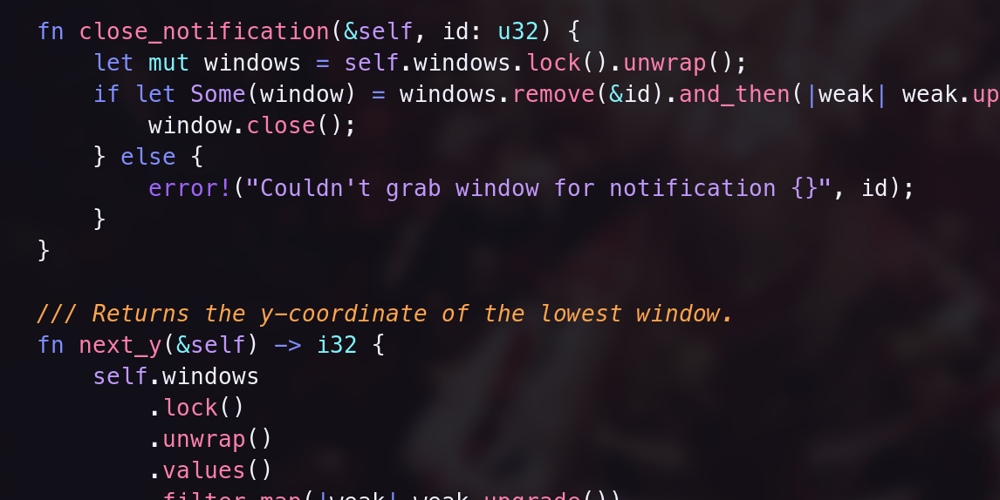

# vale - a space-inspired theme

Purples, reds, blues. Designed to be aesthetic, but not super-saturated; this is
a theme you should be able to look at for 8 hours a day.

The scheme is named after the [Veil
Nebula](https://en.wikipedia.org/wiki/Veil_Nebula); the color scheme was
originally inspired by [this
picture](https://en.wikipedia.org/wiki/Veil_Nebula#/media/File:Veil_Nebula_-_NGC6960.jpg).
The misspelling of the name is intentional, both to avoid conflict with
[vim-veil](https://github.com/swordguin/vim-veil) and because I like this
spelling more.

Currently vale requires [pgmnt.vim](https://github.com/cocopon/pgmnt.vim) in
order to compute the colors (since they're specified in HSL). Eventually I may
release a 'precompiled' version that just embeds raw hex codes.

## Screenshots

